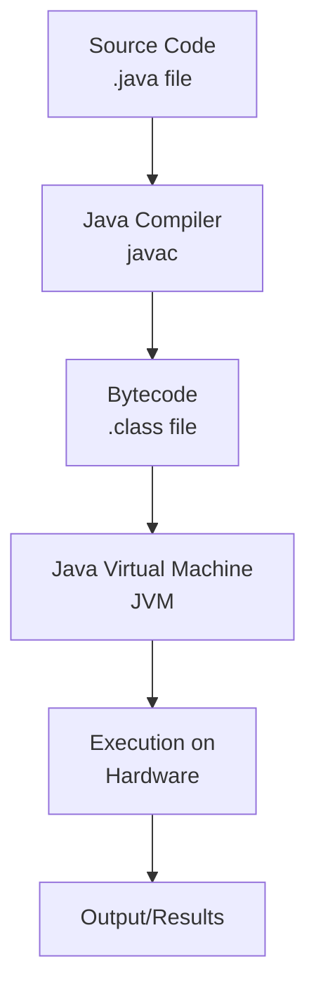
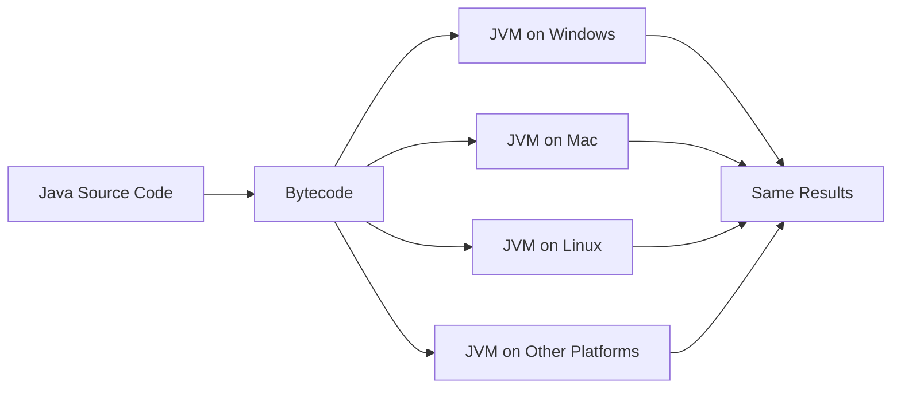

# Chapter 1: Computer Basics

## Overview

This chapter introduces the fundamental concepts of computer hardware, software, and how Java programs are executed. Understanding these basics is crucial for becoming an effective Java programmer.

## Table of Contents

1. [Computer Hardware Components](#computer-hardware-components)
2. [Program Execution](#program-execution)
3. [Java Virtual Machine (JVM)](#java-virtual-machine-jvm)
4. [Platform Independence](#platform-independence)
5. [Java Applications](#java-applications)

---

## Computer Hardware Components

A computer system consists of several key hardware components that work together to execute programs:

### 1. CPU (Central Processing Unit)

- **Function**: The "brain" of the computer that executes instructions
- **Role**: Performs arithmetic, logical, and control operations
- **Speed**: Measured in GHz (gigahertz) - number of cycles per second

### 2. Memory (RAM - Random Access Memory)

- **Function**: Temporary storage for programs and data currently in use
- **Characteristics**:
  - Volatile (data lost when power is off)
  - Fast access compared to storage devices
  - Limited capacity
- **Role**: Stores program instructions and data during execution

### 3. Storage Devices

- **Types**: Hard drives (HDD), Solid State Drives (SSD), USB drives
- **Function**: Permanent storage for programs and data
- **Characteristics**:
  - Non-volatile (data persists when power is off)
  - Slower than memory but larger capacity
  - Stores operating system, applications, and files

### 4. Input/Output Devices

- **Input Devices**: Keyboard, mouse, scanner, microphone
- **Output Devices**: Monitor, printer, speakers
- **Function**: Allow interaction between user and computer

### 5. Communication Devices

- **Types**: Network cards, modems, routers
- **Function**: Enable communication between computers over networks
- **Role**: Essential for Internet connectivity and distributed applications

---

## Program Execution

### How Programs Work

Programs are sets of instructions that tell the computer what to do. The execution process involves several steps:



### Compiler vs Interpreter

**Compiler**:

- Translates entire program before execution
- Produces machine code or intermediate code (bytecode)
- Faster execution
- Examples: Java compiler (javac), C++ compiler

**Interpreter**:

- Translates and executes line by line
- No separate compilation step
- Slower execution but easier debugging
- Examples: Python interpreter, JavaScript engine

**Java's Approach**:

- Uses a **compiler** to translate source code to bytecode
- Uses an **interpreter** (JVM) to execute bytecode
- This hybrid approach provides both portability and reasonable performance

---

## Java Virtual Machine (JVM)

### What is JVM?

The Java Virtual Machine is a virtual computer that executes Java bytecode. It acts as an abstraction layer between Java programs and the underlying hardware.

### Key Concepts

1. **Bytecode**:

   - Intermediate code between source code and machine code
   - Platform-independent binary format
   - Stored in `.class` files

2. **JVM Components**:

   - **Class Loader**: Loads bytecode into memory
   - **Execution Engine**: Interprets or compiles bytecode to machine code
   - **Memory Management**: Manages heap and stack
   - **Garbage Collector**: Automatically frees unused memory

3. **Just-In-Time (JIT) Compilation**:
   - Modern JVMs compile frequently-used bytecode to native machine code
   - Improves performance by combining interpretation and compilation

### Execution Flow

```
Java Source Code (.java)
    ↓
Java Compiler (javac)
    ↓
Bytecode (.class)
    ↓
JVM (interprets/compiles bytecode)
    ↓
Native Machine Code
    ↓
Hardware Execution
```

---

## Platform Independence

### What is Platform Independence?

Java's "Write Once, Run Anywhere" (WORA) philosophy means:

- Write code once
- Compile to bytecode once
- Run on any platform with a JVM

### How It Works



### Benefits

1. **Portability**: Same code runs on different operating systems
2. **Cost Savings**: No need to rewrite code for each platform
3. **Maintenance**: Easier to maintain one codebase
4. **Internet Applications**: Perfect for web-based applications

### Requirements

- Each platform needs its own JVM implementation
- JVM is platform-specific, but bytecode is platform-independent
- JVM translates bytecode to platform-specific machine code

---

## Java Applications

### Types of Java Programs

#### 1. Standalone Applications

- Run directly on the computer
- Have a `main` method as entry point
- Examples: Desktop applications, command-line tools

#### 2. Applets (Historical)

- **Note**: Applets are deprecated in modern Java
- Were small programs embedded in web pages
- Ran in browser using Java plugin
- Replaced by modern web technologies

#### 3. Server-Side Programs

- Run on servers
- Handle requests from clients
- Examples:
  - **Servlets**: Handle HTTP requests
  - **JavaServer Pages (JSP)**: Dynamic web content
  - **Enterprise JavaBeans (EJB)**: Business logic components
  - **Spring Framework**: Modern enterprise applications

### Java Editions

1. **Java SE (Standard Edition)**

   - Core Java platform
   - Desktop and server applications
   - Most common edition for learning

2. **Java EE (Enterprise Edition)**

   - Built on Java SE
   - Enterprise-level applications
   - Includes additional APIs for large-scale systems

3. **Java ME (Micro Edition)**
   - For mobile and embedded devices
   - Smaller footprint than SE/EE

---

## Key Terminology

| Term            | Definition                                        |
| --------------- | ------------------------------------------------- |
| **Source Code** | Human-readable program written in Java            |
| **Bytecode**    | Platform-independent intermediate code            |
| **JVM**         | Java Virtual Machine - executes bytecode          |
| **JDK**         | Java Development Kit - tools for development      |
| **JRE**         | Java Runtime Environment - needed to run programs |
| **Compiler**    | Translates source code to bytecode                |
| **Interpreter** | Executes bytecode line by line                    |

---

## Common Pitfalls

1. **Confusing JDK and JRE**

   - JDK includes JRE plus development tools
   - Need JDK to write programs
   - Need JRE (or JDK) to run programs

2. **Platform Independence Misconception**

   - Java source code is NOT platform-independent
   - Bytecode IS platform-independent
   - JVM is platform-specific

3. **Applets Confusion**
   - Applets are obsolete
   - Modern web development uses JavaScript, not Java applets

---

## Best Practices

1. **Understand the Execution Model**

   - Know how source code becomes executable
   - Understand the role of JVM

2. **Platform Considerations**

   - Test on target platforms when possible
   - Be aware of platform-specific limitations

3. **Choose the Right Edition**
   - Use Java SE for most applications
   - Use Java EE for enterprise needs
   - Use Java ME for embedded systems

---

## Summary

- Computers consist of CPU, memory, storage, I/O, and communication devices
- Programs are instructions that computers execute
- Java uses a compiler to create bytecode, which runs on JVM
- JVM provides platform independence through bytecode interpretation
- Java supports various application types: standalone, server-side, and (historically) applets
- Understanding these basics is essential for effective Java programming

---

## References

- Textbook: "Intro to Java Y D Liang" - Chapter 1
- Java Documentation: [Oracle Java Documentation](https://docs.oracle.com/javase/)
