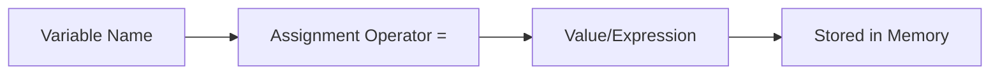

# Chapter 2: Elementary Programming

## Overview

This chapter covers the fundamental building blocks of Java programming: variables, data types, operators, input/output, and error handling. These concepts form the foundation for all Java programs.

## Table of Contents

1. [Variables and Data Types](#variables-and-data-types)
2. [Assignment Statements](#assignment-statements)
3. [Constants](#constants)
4. [Operators](#operators)
5. [Type Conversion](#type-conversion)
6. [Console Input with Scanner](#console-input-with-scanner)
7. [String Operations](#string-operations)
8. [Programming Errors](#programming-errors)

---

## Variables and Data Types

### What is a Variable?

A variable is a named memory location that stores a value. Variables allow programs to store and manipulate data.

### Variable Declaration Syntax

```java
dataType variableName;
// or with initialization
dataType variableName = value;
```

### Primitive Data Types

Java has eight primitive data types:

| Type | Size | Range | Default Value | Example |
|------|------|-------|---------------|---------|
| `byte` | 1 byte | -128 to 127 | 0 | `byte age = 25;` |
| `short` | 2 bytes | -32,768 to 32,767 | 0 | `short count = 1000;` |
| `int` | 4 bytes | -2³¹ to 2³¹-1 | 0 | `int number = 42;` |
| `long` | 8 bytes | -2⁶³ to 2⁶³-1 | 0L | `long bigNumber = 1000000L;` |
| `float` | 4 bytes | ±3.4×10³⁸ | 0.0f | `float price = 19.99f;` |
| `double` | 8 bytes | ±1.7×10³⁰⁸ | 0.0d | `double pi = 3.14159;` |
| `char` | 2 bytes | Unicode characters | '\u0000' | `char grade = 'A';` |
| `boolean` | 1 bit | true or false | false | `boolean isActive = true;` |

### Naming Conventions

- Must start with a letter, underscore (_), or dollar sign ($)
- Can contain letters, digits, underscores, and dollar signs
- Cannot be Java keywords (reserved words)
- Case-sensitive
- Use camelCase for variable names
- Use descriptive names

**Valid Examples:**
```java
int count;
double averageScore;
boolean isStudent;
char firstLetter;
```

**Invalid Examples:**
```java
int 2count;        // Cannot start with digit
double average-score;  // Cannot use hyphen
boolean class;      // 'class' is a keyword
```

---

## Assignment Statements

### Basic Assignment

The assignment operator (`=`) assigns a value to a variable.

```java
int x = 10;        // Declare and initialize
x = 20;            // Assign new value
int y = x;         // Assign value of x to y
```

### Assignment Flow



### Multiple Assignments

```java
int a, b, c;       // Declare multiple variables
a = b = c = 5;     // All get value 5
```

---

## Constants

### Named Constants

Constants are variables whose values cannot change after initialization. Use `final` keyword.

```java
final double PI = 3.14159;
final int MAX_STUDENTS = 100;
final String COMPANY_NAME = "Acme Corp";
```

### Benefits of Constants

1. **Readability**: Names are more meaningful than magic numbers
2. **Maintainability**: Change value in one place
3. **Error Prevention**: Cannot accidentally modify value

### Naming Convention

- Use UPPER_SNAKE_CASE for constants
- All letters uppercase with underscores

**Example:**
```java
final double TAX_RATE = 0.08;
final int MAX_ATTEMPTS = 3;
```

---

## Operators

### Arithmetic Operators

| Operator | Name | Example | Result |
|----------|------|---------|--------|
| `+` | Addition | `5 + 3` | 8 |
| `-` | Subtraction | `5 - 3` | 2 |
| `*` | Multiplication | `5 * 3` | 15 |
| `/` | Division | `5 / 3` | 1 (integer) |
| `%` | Modulus | `5 % 3` | 2 |

**Integer Division:**
```java
int result = 5 / 3;  // Result is 1, not 1.67
double result2 = 5.0 / 3;  // Result is 1.666...
```

### Shorthand Operators

| Operator | Equivalent To | Example |
|----------|---------------|---------|
| `+=` | `x = x + y` | `x += 5;` |
| `-=` | `x = x - y` | `x -= 3;` |
| `*=` | `x = x * y` | `x *= 2;` |
| `/=` | `x = x / y` | `x /= 4;` |
| `%=` | `x = x % y` | `x %= 3;` |

### Increment and Decrement

```java
int x = 5;
x++;        // Post-increment: x becomes 6
++x;        // Pre-increment: x becomes 7
x--;        // Post-decrement: x becomes 6
--x;        // Pre-decrement: x becomes 5
```

**Difference:**
```java
int a = 5;
int b = a++;  // b = 5, a = 6 (post-increment)

int c = 5;
int d = ++c;  // d = 6, c = 6 (pre-increment)
```

### Operator Precedence

Operators are evaluated in this order (highest to lowest):

1. Parentheses `()`
2. Unary operators (`++`, `--`, `+`, `-`, `!`)
3. Multiplicative (`*`, `/`, `%`)
4. Additive (`+`, `-`)
5. Relational (`<`, `>`, `<=`, `>=`)
6. Equality (`==`, `!=`)
7. Logical AND (`&&`)
8. Logical OR (`||`)
9. Assignment (`=`, `+=`, `-=`, etc.)

**Example:**
```java
int result = 2 + 3 * 4;        // Result: 14 (not 20)
int result2 = (2 + 3) * 4;     // Result: 20
```

---

## Type Conversion

### Implicit Conversion (Widening)

Automatic conversion from smaller to larger types.

```java
int x = 5;
double y = x;  // int automatically converted to double
```

**Conversion Hierarchy:**
```
byte → short → int → long → float → double
char → int → long → float → double
```

### Explicit Conversion (Casting)

Manual conversion using cast operator `(type)`.

```java
double x = 5.7;
int y = (int) x;  // y = 5 (truncates, doesn't round)
```

**Example:**
```java
int total = 7;
int count = 3;
double average = (double) total / count;  // Result: 2.333...
```

### Common Casting Scenarios

```java
// Double to int (loses decimal part)
double price = 19.99;
int dollars = (int) price;  // dollars = 19

// Char to int (gets ASCII/Unicode value)
char letter = 'A';
int code = (int) letter;  // code = 65

// Int to char (gets character)
int num = 65;
char ch = (char) num;  // ch = 'A'
```

---

## Console Input with Scanner

### Import Statement

```java
import java.util.Scanner;
```

### Creating a Scanner Object

```java
Scanner input = new Scanner(System.in);
```

### Reading Different Data Types

| Method | Returns | Example |
|--------|---------|---------|
| `nextByte()` | byte | `byte age = input.nextByte();` |
| `nextShort()` | short | `short count = input.nextShort();` |
| `nextInt()` | int | `int number = input.nextInt();` |
| `nextLong()` | long | `long bigNum = input.nextLong();` |
| `nextFloat()` | float | `float price = input.nextFloat();` |
| `nextDouble()` | double | `double value = input.nextDouble();` |
| `next()` | String (single word) | `String word = input.next();` |
| `nextLine()` | String (entire line) | `String line = input.nextLine();` |

### Example

```java
import java.util.Scanner;

public class InputExample {
    public static void main(String[] args) {
        Scanner input = new Scanner(System.in);
        
        System.out.print("Enter your name: ");
        String name = input.nextLine();
        
        System.out.print("Enter your age: ");
        int age = input.nextInt();
        
        System.out.print("Enter your GPA: ");
        double gpa = input.nextDouble();
        
        System.out.println("Name: " + name);
        System.out.println("Age: " + age);
        System.out.println("GPA: " + gpa);
        
        input.close();  // Close scanner when done
    }
}
```

### Common Pitfalls

1. **Mixing nextLine() with other methods:**
   ```java
   int num = input.nextInt();
   String line = input.nextLine();  // May read empty string!
   // Solution: Add extra nextLine() or use nextLine() and parse
   ```

2. **Not closing Scanner:**
   - Always close Scanner when done: `input.close();`

---

## String Operations

### String Basics

Strings are sequences of characters. In Java, `String` is a class (not primitive type).

```java
String message = "Hello, World!";
String empty = "";  // Empty string
```

### String Concatenation

```java
String firstName = "John";
String lastName = "Doe";
String fullName = firstName + " " + lastName;  // "John Doe"

int age = 25;
String info = "Age: " + age;  // "Age: 25" (automatic conversion)
```

### Common String Methods

| Method | Description | Example |
|--------|-------------|---------|
| `length()` | Returns string length | `"Hello".length()` → 5 |
| `charAt(index)` | Returns character at index | `"Hello".charAt(0)` → 'H' |
| `substring(start)` | Returns substring from start | `"Hello".substring(1)` → "ello" |
| `substring(start, end)` | Returns substring | `"Hello".substring(1, 4)` → "ell" |
| `toLowerCase()` | Converts to lowercase | `"Hello".toLowerCase()` → "hello" |
| `toUpperCase()` | Converts to uppercase | `"Hello".toUpperCase()` → "HELLO" |
| `equals(str)` | Compares strings | `"Hello".equals("Hello")` → true |
| `equalsIgnoreCase(str)` | Case-insensitive comparison | `"Hello".equalsIgnoreCase("hello")` → true |

### String Immutability

Strings in Java are immutable (cannot be changed). Operations create new strings.

```java
String s = "Hello";
s = s + " World";  // Creates new string, doesn't modify original
```

---

## Programming Errors

### Three Types of Errors

#### 1. Syntax Errors (Compile-time)

Errors in code structure that prevent compilation.

**Examples:**
```java
int x = 5  // Missing semicolon
int y = "hello";  // Wrong type
System.out.println("Hello"  // Missing closing parenthesis
```

**Characteristics:**
- Detected by compiler
- Must be fixed before program runs
- Error messages usually indicate line number

#### 2. Runtime Errors

Errors that occur during program execution.

**Examples:**
```java
int x = 5 / 0;  // Division by zero (ArithmeticException)
int[] arr = new int[5];
int value = arr[10];  // Array index out of bounds
Scanner input = new Scanner(System.in);
int num = input.nextInt();  // InputMismatchException if non-integer entered
```

**Characteristics:**
- Program compiles successfully
- Error occurs when program runs
- May crash program or throw exceptions

#### 3. Logic Errors

Program runs but produces incorrect results.

**Examples:**
```java
// Wrong formula
double average = (a + b) / 2;  // Should be (a + b) / 2.0 for double result

// Wrong operator
if (age = 18) {  // Should be ==, not =
    // ...
}

// Off-by-one error
for (int i = 0; i <= array.length; i++) {  // Should be <
    // ...
}
```

**Characteristics:**
- Hardest to find
- Program runs without crashing
- Results are incorrect
- Requires careful testing and debugging

### Error Prevention Strategies

1. **Syntax Errors:**
   - Use IDE with syntax highlighting
   - Compile frequently
   - Read error messages carefully

2. **Runtime Errors:**
   - Validate input
   - Check array bounds
   - Handle exceptions
   - Test edge cases

3. **Logic Errors:**
   - Plan algorithm carefully
   - Test with known values
   - Use debugger
   - Add print statements for debugging

---

## Best Practices

1. **Use meaningful variable names**
   ```java
   int x;  // Bad
   int studentCount;  // Good
   ```

2. **Initialize variables**
   ```java
   int count = 0;  // Always initialize
   ```

3. **Use constants for magic numbers**
   ```java
   final double TAX_RATE = 0.08;  // Good
   double total = price * 0.08;  // Bad (magic number)
   ```

4. **Close resources**
   ```java
   Scanner input = new Scanner(System.in);
   // ... use scanner ...
   input.close();  // Always close
   ```

5. **Handle input errors**
   ```java
   try {
       int num = input.nextInt();
   } catch (InputMismatchException e) {
       System.out.println("Invalid input!");
   }
   ```

---

## Summary

- Variables store data with specific types (int, double, char, boolean, etc.)
- Assignment statements store values in variables
- Constants use `final` keyword and cannot be changed
- Operators perform arithmetic, comparison, and logical operations
- Type conversion can be implicit (widening) or explicit (casting)
- Scanner class enables console input
- String class provides text manipulation methods
- Three error types: syntax (compile-time), runtime, and logic errors
- Understanding these fundamentals is essential for Java programming

---

## References

- Textbook: "Intro to Java Y D Liang" - Chapter 2
- Java Documentation: [Primitive Data Types](https://docs.oracle.com/javase/tutorial/java/nutsandbolts/datatypes.html)

