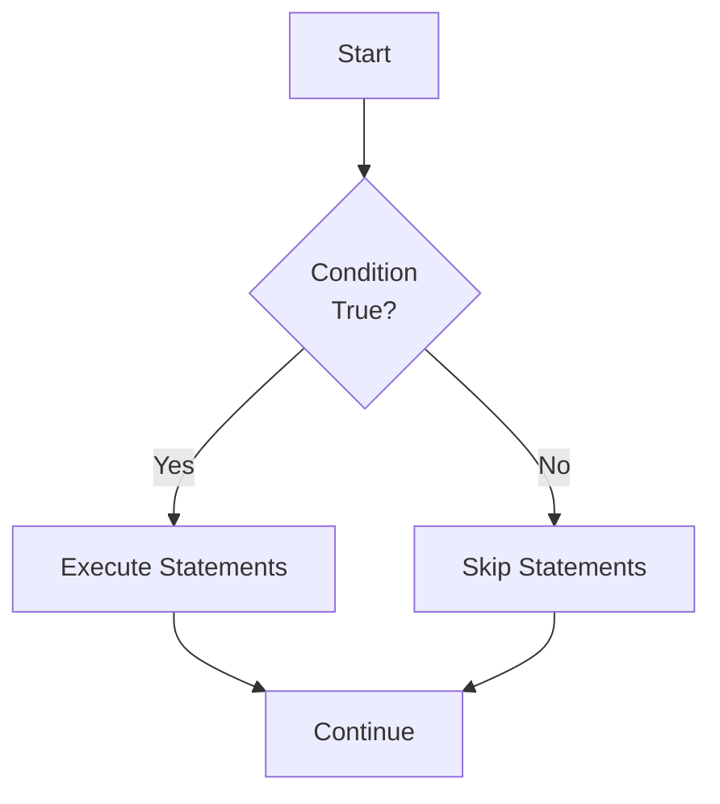
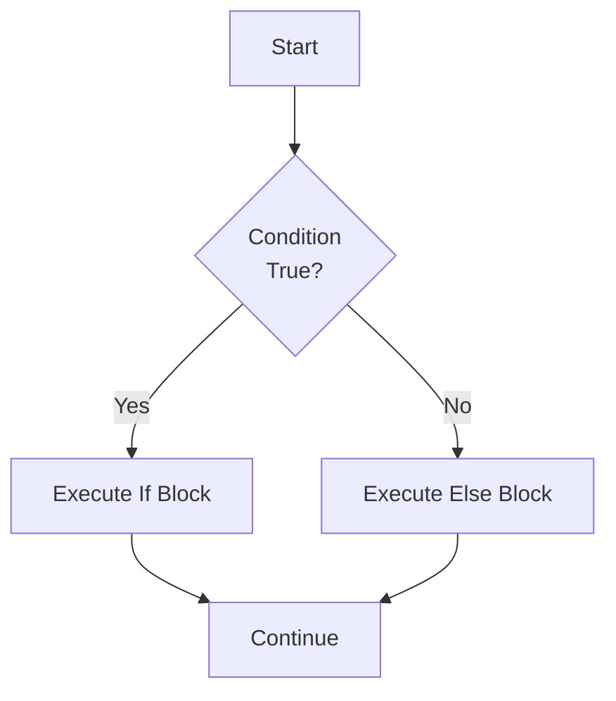
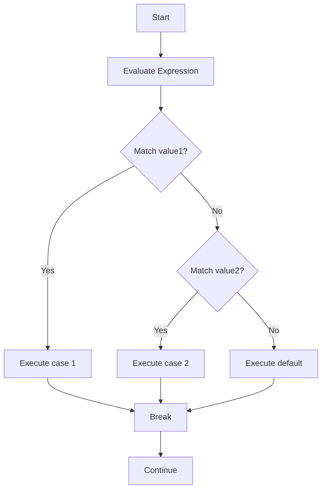

# Chapter 3: Selections

## Overview

This chapter covers decision-making in Java programs using selection statements. You'll learn how to control program flow based on conditions using if statements, switch statements, and logical operators.

## Table of Contents

1. [Boolean Values and Expressions](#boolean-values-and-expressions)
2. [If Statements](#if-statements)
3. [Switch Statements](#switch-statements)
4. [Logical Operators](#logical-operators)
5. [Conditional Expressions](#conditional-expressions)
6. [Operator Precedence](#operator-precedence)
7. [Formatted Output](#formatted-output)
8. [Case Studies](#case-studies)

---

## Boolean Values and Expressions

### Boolean Data Type

The `boolean` type has only two values: `true` and `false`.

```java
boolean isStudent = true;
boolean isGraduated = false;
```

### Relational Operators

Relational operators compare values and return boolean results:

| Operator | Name | Example | Result |
|----------|------|---------|--------|
| `<` | Less than | `5 < 3` | false |
| `<=` | Less than or equal | `5 <= 5` | true |
| `>` | Greater than | `5 > 3` | true |
| `>=` | Greater than or equal | `5 >= 5` | true |
| `==` | Equal to | `5 == 5` | true |
| `!=` | Not equal to | `5 != 3` | true |

**Important**: Use `==` for comparison, not `=` (which is assignment).

### Boolean Expressions

```java
int age = 18;
boolean canVote = age >= 18;  // true
boolean isMinor = age < 18;   // false
```

---

## If Statements

### One-Way If Statement

Executes code only if condition is true.

**Syntax:**
```java
if (condition) {
    // statements
}
```

**Flow Diagram:**


**Example:**
```java
int score = 85;
if (score >= 60) {
    System.out.println("You passed!");
}
```

### Two-Way If-Else Statement

Executes one block if true, another if false.

**Syntax:**
```java
if (condition) {
    // statements if true
} else {
    // statements if false
}
```

**Flow Diagram:**


**Example:**
```java
int score = 85;
if (score >= 60) {
    System.out.println("You passed!");
} else {
    System.out.println("You failed!");
}
```

### Multi-Way If-Else Statement

Handles multiple conditions.

**Syntax:**
```java
if (condition1) {
    // statements
} else if (condition2) {
    // statements
} else if (condition3) {
    // statements
} else {
    // statements
}
```

**Example:**
```java
int score = 85;
if (score >= 90) {
    System.out.println("Grade: A");
} else if (score >= 80) {
    System.out.println("Grade: B");
} else if (score >= 70) {
    System.out.println("Grade: C");
} else if (score >= 60) {
    System.out.println("Grade: D");
} else {
    System.out.println("Grade: F");
}
```

### Nested If Statements

If statements inside other if statements.

**Example:**
```java
int age = 20;
boolean hasLicense = true;

if (age >= 18) {
    if (hasLicense) {
        System.out.println("You can drive!");
    } else {
        System.out.println("You need a license!");
    }
} else {
    System.out.println("You're too young to drive!");
}
```

### Common Pitfalls

1. **Using = instead of ==**
   ```java
   if (x = 5) {  // ERROR: assignment, not comparison
   if (x == 5) { // CORRECT
   ```

2. **Dangling else problem**
   ```java
   if (x > 0)
       if (y > 0)
           System.out.println("Both positive");
   else
       System.out.println("x is not positive");  // Actually belongs to inner if!
   ```

3. **Redundant conditions**
   ```java
   if (x > 0) {
       // ...
   } else if (x <= 0) {  // Redundant: else already covers this
       // ...
   }
   ```

---

## Switch Statements

### Basic Switch Statement

Alternative to multiple if-else for comparing a variable against multiple values.

**Syntax:**
```java
switch (expression) {
    case value1:
        // statements
        break;
    case value2:
        // statements
        break;
    default:
        // statements
}
```

**Flow Diagram:**


**Example:**
```java
int day = 3;
switch (day) {
    case 1:
        System.out.println("Monday");
        break;
    case 2:
        System.out.println("Tuesday");
        break;
    case 3:
        System.out.println("Wednesday");
        break;
    default:
        System.out.println("Other day");
}
```

### Switch Rules

1. **Expression type**: Must be `char`, `byte`, `short`, `int`, `String`, or enum
2. **Case values**: Must be constants, not variables
3. **Break statement**: Prevents fall-through to next case
4. **Default case**: Optional, executes if no match

### Fall-Through Behavior

Without `break`, execution continues to next case:

```java
int day = 1;
switch (day) {
    case 1:
        System.out.println("Monday");
        // No break - falls through!
    case 2:
        System.out.println("Tuesday");
        break;
}
// Output: Monday Tuesday
```

### Switch with Strings (Java 7+)

```java
String day = "Monday";
switch (day) {
    case "Monday":
        System.out.println("Start of week");
        break;
    case "Friday":
        System.out.println("End of week");
        break;
    default:
        System.out.println("Midweek");
}
```

---

## Logical Operators

### AND Operator (&&)

Returns `true` only if both operands are `true`.

| A | B | A && B |
|---|---|--------|
| true | true | true |
| true | false | false |
| false | true | false |
| false | false | false |

**Example:**
```java
int age = 20;
boolean hasLicense = true;

if (age >= 18 && hasLicense) {
    System.out.println("You can drive!");
}
```

**Short-circuit evaluation**: If first condition is false, second is not evaluated.

### OR Operator (||)

Returns `true` if at least one operand is `true`.

| A | B | A \|\| B |
|---|---|---------|
| true | true | true |
| true | false | true |
| false | true | true |
| false | false | false |

**Example:**
```java
char grade = 'A';
if (grade == 'A' || grade == 'B') {
    System.out.println("Good grade!");
}
```

**Short-circuit evaluation**: If first condition is true, second is not evaluated.

### NOT Operator (!)

Reverses the boolean value.

| A | !A |
|---|---|
| true | false |
| false | true |

**Example:**
```java
boolean isStudent = false;
if (!isStudent) {
    System.out.println("Not a student");
}
```

### Combining Logical Operators

```java
int age = 25;
boolean hasLicense = true;
boolean hasInsurance = true;

if (age >= 18 && hasLicense && hasInsurance) {
    System.out.println("You can drive legally!");
}

if (age < 18 || !hasLicense) {
    System.out.println("Cannot drive!");
}
```

### Truth Tables Summary

```mermaid
graph TD
    A[Logical Operators] --> B[AND &&]
    A --> C[OR ||]
    A --> D[NOT !]
    B --> E[Both true = true]
    C --> F[Either true = true]
    D --> G[Reverses value]
```

---

## Conditional Expressions

### Ternary Operator

Shorthand for if-else statement.

**Syntax:**
```java
condition ? valueIfTrue : valueIfFalse
```

**Example:**
```java
int score = 85;
String result = (score >= 60) ? "Pass" : "Fail";
System.out.println(result);  // "Pass"
```

**Equivalent if-else:**
```java
String result;
if (score >= 60) {
    result = "Pass";
} else {
    result = "Fail";
}
```

### Nested Conditional Expressions

```java
int score = 85;
String grade = (score >= 90) ? "A" : 
               (score >= 80) ? "B" : 
               (score >= 70) ? "C" : "F";
```

**Use with caution**: Can become hard to read if overused.

---

## Operator Precedence

Operators are evaluated in this order (highest to lowest):

1. Parentheses `()`
2. Unary operators (`++`, `--`, `+`, `-`, `!`)
3. Multiplicative (`*`, `/`, `%`)
4. Additive (`+`, `-`)
5. Relational (`<`, `>`, `<=`, `>=`)
6. Equality (`==`, `!=`)
7. Logical AND (`&&`)
8. Logical OR (`||`)
9. Conditional (`?:`)
10. Assignment (`=`, `+=`, `-=`, etc.)

**Examples:**
```java
int x = 5, y = 3, z = 2;
boolean result1 = x > y && y > z;        // true && true = true
boolean result2 = x > y || y > z;        // true || true = true
boolean result3 = !(x > y);              // !true = false
boolean result4 = x > y && y > z || x < z;  // true && true || false = true
```

**Use parentheses for clarity:**
```java
// Unclear
if (x > 0 && y > 0 || z > 0) { ... }

// Clear
if ((x > 0 && y > 0) || z > 0) { ... }
```

---

## Formatted Output

### printf Method

The `System.out.printf()` method allows formatted output similar to C's printf.

**Syntax:**
```java
System.out.printf(format, arguments);
```

### Format Specifiers

| Specifier | Type | Example | Output |
|-----------|------|---------|--------|
| `%d` | Integer | `printf("%d", 42)` | 42 |
| `%f` | Floating-point | `printf("%f", 3.14)` | 3.140000 |
| `%s` | String | `printf("%s", "Hello")` | Hello |
| `%c` | Character | `printf("%c", 'A')` | A |
| `%b` | Boolean | `printf("%b", true)` | true |

### Formatting Numbers

```java
double price = 19.99;
System.out.printf("Price: $%.2f\n", price);  // Price: $19.99

int count = 42;
System.out.printf("Count: %05d\n", count);   // Count: 00042
```

### Format Specifier Syntax

```
%[flags][width][.precision]conversion
```

**Examples:**
```java
double value = 123.456789;

System.out.printf("%.2f\n", value);      // 123.46 (2 decimal places)
System.out.printf("%10.2f\n", value);   //    123.46 (width 10, right-aligned)
System.out.printf("%-10.2f\n", value);  // 123.46    (left-aligned)
System.out.printf("%010.2f\n", value);  // 0000123.46 (zero-padded)
```

### Common Formatting Examples

```java
// Currency
double price = 19.99;
System.out.printf("Price: $%.2f\n", price);

// Percentage
double rate = 0.085;
System.out.printf("Rate: %.1f%%\n", rate * 100);

// Table formatting
System.out.printf("%-10s %10s\n", "Name", "Score");
System.out.printf("%-10s %10d\n", "John", 95);
System.out.printf("%-10s %10d\n", "Jane", 87);
```

---

## Case Studies

### 1. Leap Year Determination

A year is a leap year if:
- Divisible by 4, but not by 100, OR
- Divisible by 400

```java
int year = 2024;
boolean isLeapYear = (year % 4 == 0 && year % 100 != 0) || (year % 400 == 0);

if (isLeapYear) {
    System.out.println(year + " is a leap year");
} else {
    System.out.println(year + " is not a leap year");
}
```

### 2. Lottery Matching

Check if lottery numbers match:

```java
int lottery = (int)(Math.random() * 100);
int guess = 45;  // User's guess

int lotteryDigit1 = lottery / 10;
int lotteryDigit2 = lottery % 10;
int guessDigit1 = guess / 10;
int guessDigit2 = guess % 10;

if (guess == lottery) {
    System.out.println("Exact match! You win $10,000");
} else if (guessDigit1 == lotteryDigit2 && guessDigit2 == lotteryDigit1) {
    System.out.println("Match all digits! You win $3,000");
} else if (guessDigit1 == lotteryDigit1 || guessDigit1 == lotteryDigit2 ||
           guessDigit2 == lotteryDigit1 || guessDigit2 == lotteryDigit2) {
    System.out.println("Match one digit! You win $1,000");
} else {
    System.out.println("Sorry, no match");
}
```

### 3. Tax Calculation

Calculate tax based on income brackets:

```java
double income = 50000;
double tax = 0;

if (income <= 8350) {
    tax = income * 0.10;
} else if (income <= 33950) {
    tax = 8350 * 0.10 + (income - 8350) * 0.15;
} else if (income <= 82250) {
    tax = 8350 * 0.10 + (33950 - 8350) * 0.15 + (income - 33950) * 0.25;
} else if (income <= 171550) {
    tax = 8350 * 0.10 + (33950 - 8350) * 0.15 + 
          (82250 - 33950) * 0.25 + (income - 82250) * 0.28;
} else {
    tax = 8350 * 0.10 + (33950 - 8350) * 0.15 + 
          (82250 - 33950) * 0.25 + (171550 - 82250) * 0.28 + 
          (income - 171550) * 0.33;
}

System.out.printf("Income: $%.2f\n", income);
System.out.printf("Tax: $%.2f\n", tax);
System.out.printf("After-tax income: $%.2f\n", income - tax);
```

---

## Best Practices

1. **Use meaningful conditions**
   ```java
   // Bad
   if (x) { ... }
   
   // Good
   if (isStudent) { ... }
   ```

2. **Avoid deep nesting**
   ```java
   // Bad: Too nested
   if (condition1) {
       if (condition2) {
           if (condition3) {
               // ...
           }
       }
   }
   
   // Good: Use logical operators
   if (condition1 && condition2 && condition3) {
       // ...
   }
   ```

3. **Always use braces**
   ```java
   // Bad: Easy to make mistakes
   if (x > 0)
       System.out.println("Positive");
       System.out.println("Always prints!");  // Bug!
   
   // Good: Clear intent
   if (x > 0) {
       System.out.println("Positive");
   }
   ```

4. **Use switch for multiple equality checks**
   ```java
   // Bad: Multiple if-else
   if (day == 1) { ... }
   else if (day == 2) { ... }
   else if (day == 3) { ... }
   
   // Good: Use switch
   switch (day) {
       case 1: ... break;
       case 2: ... break;
       case 3: ... break;
   }
   ```

5. **Don't forget break in switch**
   ```java
   switch (day) {
       case 1:
           System.out.println("Monday");
           break;  // Don't forget!
       // ...
   }
   ```

---

## Summary

- Boolean expressions evaluate to `true` or `false`
- If statements control program flow based on conditions
- Switch statements handle multiple equality comparisons
- Logical operators (`&&`, `||`, `!`) combine conditions
- Conditional expressions provide shorthand for if-else
- Operator precedence determines evaluation order
- Formatted output (`printf`) creates professional-looking output
- Selection statements enable decision-making in programs

---

## References

- Textbook: "Intro to Java Y D Liang" - Chapter 3
- Java Documentation: [Control Flow Statements](https://docs.oracle.com/javase/tutorial/java/nutsandbolts/flow.html)

