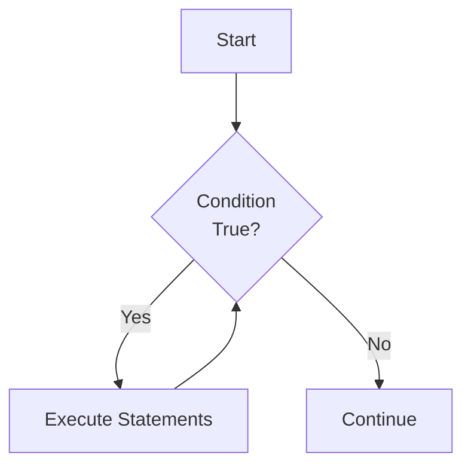
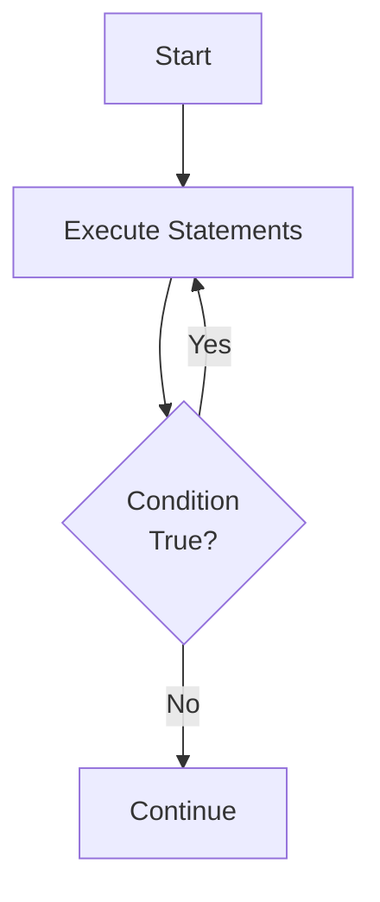
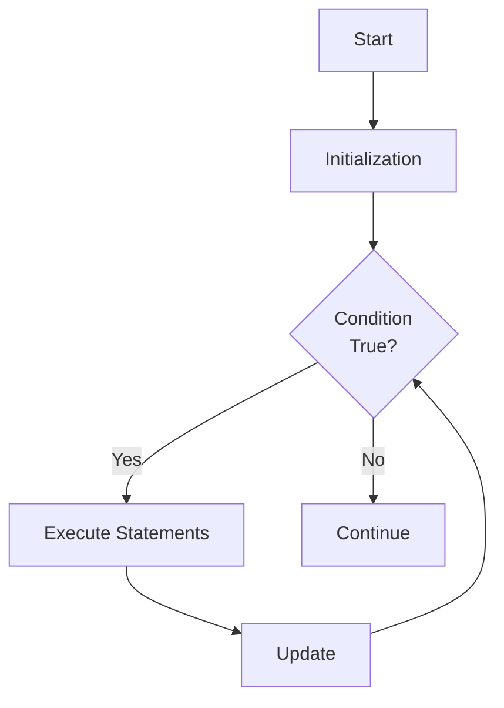

# Chapter 4: Loops

## Overview

This chapter covers repetition structures (loops) in Java. Loops allow programs to execute statements multiple times, making programs more efficient and powerful.

## Table of Contents

1. [While Loop](#while-loop)
2. [Do-While Loop](#do-while-loop)
3. [For Loop](#for-loop)
4. [Nested Loops](#nested-loops)
5. [Break and Continue](#break-and-continue)
6. [Sentinel Values](#sentinel-values)
7. [Numeric Errors](#numeric-errors)
8. [Case Studies](#case-studies)

---

## While Loop

### Basic While Loop

A while loop repeats statements as long as a condition is true. It's a **pretest loop** (condition checked before execution).

**Syntax:**
```java
while (condition) {
    // statements
}
```

**Flow Diagram:**


**Example:**
```java
int count = 0;
while (count < 5) {
    System.out.println("Count: " + count);
    count++;
}
```

### Characteristics

- **Pretest**: Condition checked before loop body executes
- **May execute zero times**: If condition is false initially
- **Requires loop control variable**: Must be modified inside loop
- **Infinite loop risk**: If condition never becomes false

### Common Patterns

**Count-controlled loop:**
```java
int i = 0;
while (i < 10) {
    System.out.println(i);
    i++;
}
```

**Condition-controlled loop:**
```java
int sum = 0;
int value = 1;
while (value != 0) {
    sum += value;
    value = input.nextInt();
}
```

---

## Do-While Loop

### Basic Do-While Loop

A do-while loop executes statements at least once, then repeats while condition is true. It's a **posttest loop** (condition checked after execution).

**Syntax:**
```java
do {
    // statements
} while (condition);
```

**Flow Diagram:**


**Example:**
```java
int choice;
do {
    System.out.println("Enter 1-5: ");
    choice = input.nextInt();
} while (choice < 1 || choice > 5);
```

### Characteristics

- **Posttest**: Condition checked after loop body executes
- **Always executes at least once**: Body executes before condition check
- **Useful for input validation**: Ensures at least one iteration

### When to Use

- Menu-driven programs
- Input validation
- When you need at least one execution

---

## For Loop

### Basic For Loop

A for loop is ideal for count-controlled loops. It combines initialization, condition, and update in one statement.

**Syntax:**
```java
for (initialization; condition; update) {
    // statements
}
```

**Flow Diagram:**


**Example:**
```java
for (int i = 0; i < 10; i++) {
    System.out.println(i);
}
```

### For Loop Components

1. **Initialization**: Executed once at start
2. **Condition**: Checked before each iteration
3. **Update**: Executed after each iteration

### Common Patterns

**Counting up:**
```java
for (int i = 0; i < 10; i++) {
    System.out.println(i);
}
```

**Counting down:**
```java
for (int i = 10; i > 0; i--) {
    System.out.println(i);
}
```

**Step size:**
```java
for (int i = 0; i < 100; i += 5) {
    System.out.println(i);  // 0, 5, 10, 15, ...
}
```

**Multiple variables:**
```java
for (int i = 0, j = 10; i < 10; i++, j--) {
    System.out.println(i + " " + j);
}
```

### Enhanced For Loop (For-Each)

Iterates through arrays or collections.

**Syntax:**
```java
for (elementType element : array) {
    // statements
}
```

**Example:**
```java
int[] numbers = {1, 2, 3, 4, 5};
for (int num : numbers) {
    System.out.println(num);
}
```

---

## Nested Loops

### Concept

A loop inside another loop. The inner loop completes all iterations for each iteration of the outer loop.

**Example:**
```java
for (int i = 1; i <= 3; i++) {
    for (int j = 1; j <= 3; j++) {
        System.out.println(i + " " + j);
    }
}
// Output: 1 1, 1 2, 1 3, 2 1, 2 2, 2 3, 3 1, 3 2, 3 3
```

### Common Applications

**Pattern printing:**
```java
for (int i = 1; i <= 5; i++) {
    for (int j = 1; j <= i; j++) {
        System.out.print("*");
    }
    System.out.println();
}
```

**Two-dimensional processing:**
```java
for (int row = 0; row < 3; row++) {
    for (int col = 0; col < 3; col++) {
        System.out.print(matrix[row][col] + " ");
    }
    System.out.println();
}
```

### Performance Consideration

Total iterations = outer iterations × inner iterations

---

## Break and Continue

### Break Statement

Exits the loop immediately, skipping remaining iterations.

**Example:**
```java
for (int i = 0; i < 10; i++) {
    if (i == 5) {
        break;  // Exit loop when i == 5
    }
    System.out.println(i);
}
// Output: 0, 1, 2, 3, 4
```

**Breaking nested loops:**
```java
outer: for (int i = 0; i < 3; i++) {
    for (int j = 0; j < 3; j++) {
        if (i * j == 4) {
            break outer;  // Breaks outer loop
        }
    }
}
```

### Continue Statement

Skips remaining statements in current iteration, continues with next iteration.

**Example:**
```java
for (int i = 0; i < 10; i++) {
    if (i % 2 == 0) {
        continue;  // Skip even numbers
    }
    System.out.println(i);
}
// Output: 1, 3, 5, 7, 9
```

### When to Use

- **Break**: When you find what you're looking for
- **Continue**: When you want to skip certain iterations

---

## Sentinel Values

### Concept

A special value that signals the end of input. Used when the number of iterations is unknown.

**Example:**
```java
int sum = 0;
int value;
System.out.print("Enter values (0 to stop): ");
while ((value = input.nextInt()) != 0) {
    sum += value;
}
System.out.println("Sum: " + sum);
```

### Common Sentinel Values

- `0` for numbers
- `-1` for positive numbers
- `"quit"` for strings
- `null` for objects

### Input Loop Pattern

```java
int value;
int sum = 0;
int count = 0;

System.out.print("Enter values (-1 to stop): ");
value = input.nextInt();

while (value != -1) {
    sum += value;
    count++;
    System.out.print("Enter values (-1 to stop): ");
    value = input.nextInt();
}

double average = (double) sum / count;
```

---

## Numeric Errors

### Floating-Point Precision

Floating-point numbers are approximations, not exact values.

**Problem:**
```java
double sum = 0;
for (int i = 0; i < 10; i++) {
    sum += 0.1;
}
System.out.println(sum);  // May not be exactly 1.0
```

**Solution:**
```java
// Use integers when possible
int sum = 0;
for (int i = 0; i < 10; i++) {
    sum += 1;
}
double result = sum / 10.0;
```

### Minimizing Errors

1. **Use integers for counting**: Avoid floating-point for loop counters
2. **Compare with tolerance**: Don't use `==` with floating-point
3. **Use BigDecimal for precision**: When exact decimal arithmetic needed

**Example:**
```java
// Wrong
if (x == 0.1) { ... }

// Right
if (Math.abs(x - 0.1) < 0.0001) { ... }
```

---

## Case Studies

### 1. Greatest Common Divisor (GCD)

Find GCD using Euclidean algorithm.

```java
int n1 = 48;
int n2 = 18;

while (n2 != 0) {
    int temp = n2;
    n2 = n1 % n2;
    n1 = temp;
}

System.out.println("GCD: " + n1);
```

### 2. Future Tuition Prediction

Calculate when tuition doubles.

```java
double tuition = 10000;
double targetTuition = tuition * 2;
int years = 0;
double rate = 0.07;  // 7% increase per year

while (tuition < targetTuition) {
    tuition *= (1 + rate);
    years++;
}

System.out.println("Tuition will double in " + years + " years");
```

### 3. Monte Carlo π Simulation

Estimate π using random points.

```java
int numberOfHits = 0;
int numberOfTrials = 1000000;

for (int i = 0; i < numberOfTrials; i++) {
    double x = Math.random();
    double y = Math.random();
    
    if (x * x + y * y <= 1) {
        numberOfHits++;
    }
}

double pi = 4.0 * numberOfHits / numberOfTrials;
System.out.println("Estimated π: " + pi);
```

---

## Loop Comparison

| Feature | while | do-while | for |
|---------|-------|----------|-----|
| **Test Type** | Pretest | Posttest | Pretest |
| **Min Executions** | 0 | 1 | 0 |
| **Best For** | Condition-controlled | Input validation | Count-controlled |
| **Initialization** | Before loop | Before loop | In header |
| **Update** | In body | In body | In header |

---

## Best Practices

1. **Choose the right loop**
   - `for`: Count-controlled
   - `while`: Condition-controlled
   - `do-while`: Need at least one execution

2. **Avoid infinite loops**
   ```java
   // Bad: Infinite loop
   while (true) {
       // No way to exit!
   }
   
   // Good: Has exit condition
   boolean running = true;
   while (running) {
       if (someCondition) {
           running = false;
       }
   }
   ```

3. **Initialize loop control variable**
   ```java
   int i = 0;  // Always initialize
   while (i < 10) {
       // ...
       i++;
   }
   ```

4. **Update loop control variable**
   ```java
   // Bad: Forgot to update
   int i = 0;
   while (i < 10) {
       System.out.println(i);
       // Missing i++;
   }
   ```

5. **Use meaningful variable names**
   ```java
   // Bad
   for (int i = 0; i < 10; i++) { ... }
   
   // Good
   for (int studentIndex = 0; studentIndex < 10; studentIndex++) { ... }
   ```

---

## Summary

- **while loop**: Pretest, condition-controlled, may execute zero times
- **do-while loop**: Posttest, always executes at least once
- **for loop**: Pretest, count-controlled, combines initialization/condition/update
- **Nested loops**: Loop inside loop, useful for 2D processing
- **break**: Exits loop immediately
- **continue**: Skips to next iteration
- **Sentinel values**: Signal end of input
- **Numeric errors**: Be careful with floating-point precision
- Choose the right loop type for your task

---

## References

- Textbook: "Intro to Java Y D Liang" - Chapter 4
- Java Documentation: [Control Flow](https://docs.oracle.com/javase/tutorial/java/nutsandbolts/flow.html)

