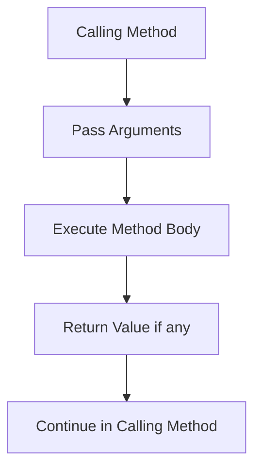

# Chapter 5: Methods

## Overview

This chapter covers methods (functions) in Java. Methods allow you to break programs into smaller, reusable pieces, making code more modular, maintainable, and easier to understand.

## Table of Contents

1. [Method Definition](#method-definition)
2. [Method Invocation](#method-invocation)
3. [Value-Returning Methods](#value-returning-methods)
4. [Void Methods](#void-methods)
5. [Passing Arguments](#passing-arguments)
6. [Method Overloading](#method-overloading)
7. [Scope Rules](#scope-rules)
8. [Math Class Methods](#math-class-methods)
9. [Stepwise Refinement](#stepwise-refinement)

---

## Method Definition

### What is a Method?

A method is a named block of code that performs a specific task. Methods help organize code and enable code reuse.

### Method Syntax

```java
modifier returnType methodName(parameterList) {
    // method body
    return value;  // if returnType is not void
}
```

### Method Components

1. **Modifier**: Access level (public, private, etc.) and other modifiers (static, etc.)
2. **Return Type**: Data type of value returned, or `void` if nothing returned
3. **Method Name**: Identifier for the method
4. **Parameter List**: Variables that receive values from caller (can be empty)
5. **Method Body**: Statements that define what the method does

**Example:**
```java
public static int add(int a, int b) {
    return a + b;
}
```

### Method Header vs Method Body

- **Header**: `public static int add(int a, int b)`
- **Body**: `{ return a + b; }`

---

## Method Invocation

### Calling a Method

To use a method, you **invoke** (call) it by using its name followed by parentheses.

**Syntax:**
```java
methodName(arguments);
```

**Example:**
```java
int result = add(5, 3);  // Calls add method with arguments 5 and 3
```

### Method Call Flow



### Calling Static Methods

Static methods belong to the class, not instances. Call using class name or directly if in same class.

```java
// In same class
int result = add(5, 3);

// From another class
int result = Math.max(5, 3);
```

---

## Value-Returning Methods

### Definition

Methods that compute and return a value.

**Syntax:**
```java
public static returnType methodName(parameters) {
    // statements
    return value;  // Must return a value of returnType
}
```

**Example:**
```java
public static int square(int number) {
    return number * number;
}
```

### Return Statement

- Must return a value matching the return type
- Execution stops when return is encountered
- Can have multiple return statements (but only one executes)

**Example:**
```java
public static int max(int a, int b) {
    if (a > b) {
        return a;
    } else {
        return b;
    }
}
```

### Using Return Values

```java
int result = square(5);  // result = 25
System.out.println(square(3));  // Prints 9
int sum = square(2) + square(3);  // sum = 4 + 9 = 13
```

---

## Void Methods

### Definition

Methods that perform actions but don't return a value.

**Syntax:**
```java
public static void methodName(parameters) {
    // statements
    // No return statement (or return; with no value)
}
```

**Example:**
```java
public static void printMessage(String message) {
    System.out.println(message);
}
```

### Calling Void Methods

```java
printMessage("Hello, World!");  // Just call, don't assign
```

### Return Statement in Void Methods

You can use `return;` (without value) to exit early:

```java
public static void printPositive(int number) {
    if (number <= 0) {
        return;  // Exit early
    }
    System.out.println(number);
}
```

---

## Passing Arguments

### Pass by Value

Java passes arguments **by value**. A copy of the argument is passed to the method.

**Important**: Changes to parameters don't affect original variables (for primitive types).

**Example:**
```java
public static void increment(int x) {
    x++;  // Only changes local copy
}

int num = 5;
increment(num);
System.out.println(num);  // Still 5, not 6!
```

### Primitive Types vs Reference Types

- **Primitive types** (int, double, etc.): Value is copied
- **Reference types** (arrays, objects): Reference is copied, but object can be modified

**Example with arrays:**
```java
public static void modifyArray(int[] arr) {
    arr[0] = 100;  // Modifies original array
}

int[] numbers = {1, 2, 3};
modifyArray(numbers);
System.out.println(numbers[0]);  // Prints 100
```

### Actual vs Formal Parameters

- **Actual parameters** (arguments): Values passed when calling method
- **Formal parameters** (parameters): Variables in method definition

```java
// Formal parameter: int a, int b
public static int add(int a, int b) {
    return a + b;
}

// Actual parameters: 5, 3
int result = add(5, 3);
```

---

## Method Overloading

### Definition

Multiple methods can have the same name if they have different parameter lists.

**Rules:**
- Methods must have same name
- Parameter lists must differ (number, type, or order)
- Return type doesn't matter for overloading

**Example:**
```java
public static int add(int a, int b) {
    return a + b;
}

public static double add(double a, double b) {
    return a + b;
}

public static int add(int a, int b, int c) {
    return a + b + c;
}
```

### Overloading Examples

```java
// Different number of parameters
public static int max(int a, int b) { ... }
public static int max(int a, int b, int c) { ... }

// Different types
public static int square(int x) { ... }
public static double square(double x) { ... }

// Different order
public static void print(int a, String b) { ... }
public static void print(String a, int b) { ... }
```

### Method Resolution

Java determines which overloaded method to call based on argument types:

```java
add(5, 3);        // Calls add(int, int)
add(5.0, 3.0);    // Calls add(double, double)
add(5, 3, 2);     // Calls add(int, int, int)
```

---

## Scope Rules

### Variable Scope

Scope determines where a variable can be accessed.

### Local Variables

Variables declared inside a method are **local** to that method.

```java
public static void method1() {
    int x = 5;  // Local to method1
}

public static void method2() {
    // x is not accessible here
    int x = 10;  // Different variable, also local to method2
}
```

### Scope Rules

1. **Local scope**: Variable declared in method is accessible only in that method
2. **Block scope**: Variable declared in block is accessible only in that block
3. **Parameter scope**: Parameters are local to the method
4. **Shadowing**: Local variable can hide variable with same name in outer scope

**Example:**
```java
public static void example() {
    int x = 10;  // Outer x
    
    if (true) {
        int x = 20;  // Error! Can't redeclare in same scope
        int y = 30;  // Local to if block
    }
    // y is not accessible here
}
```

### Lifetime

- Variables exist only while their scope is active
- Local variables are created when method is called
- Local variables are destroyed when method returns

---

## Math Class Methods

### Common Math Methods

The `Math` class provides many useful mathematical methods.

| Method | Description | Example |
|--------|-------------|---------|
| `Math.pow(a, b)` | a raised to power b | `Math.pow(2, 3)` = 8.0 |
| `Math.sqrt(x)` | Square root of x | `Math.sqrt(16)` = 4.0 |
| `Math.abs(x)` | Absolute value | `Math.abs(-5)` = 5 |
| `Math.max(a, b)` | Maximum of a and b | `Math.max(5, 3)` = 5 |
| `Math.min(a, b)` | Minimum of a and b | `Math.min(5, 3)` = 3 |
| `Math.random()` | Random number [0.0, 1.0) | `Math.random()` |
| `Math.round(x)` | Round to nearest integer | `Math.round(3.7)` = 4 |
| `Math.ceil(x)` | Round up | `Math.ceil(3.2)` = 4.0 |
| `Math.floor(x)` | Round down | `Math.floor(3.7)` = 3.0 |
| `Math.PI` | Constant π | `Math.PI` ≈ 3.14159 |
| `Math.E` | Constant e | `Math.E` ≈ 2.71828 |

### Examples

```java
double power = Math.pow(2, 10);        // 1024.0
double root = Math.sqrt(25);           // 5.0
int maximum = Math.max(10, 20);        // 20
double random = Math.random();         // 0.0 to 1.0
int randomInt = (int)(Math.random() * 10);  // 0 to 9
```

### Random Number Generation

```java
// Random integer from 0 to 9
int random1 = (int)(Math.random() * 10);

// Random integer from 1 to 10
int random2 = (int)(Math.random() * 10) + 1;

// Random integer from min to max (inclusive)
int random3 = (int)(Math.random() * (max - min + 1)) + min;
```

---

## Stepwise Refinement

### Concept

Break complex problems into smaller, manageable subproblems. Each subproblem becomes a method.

### Benefits

1. **Modularity**: Each method does one thing
2. **Reusability**: Methods can be used multiple times
3. **Readability**: Easier to understand
4. **Maintainability**: Easier to modify and debug
5. **Testing**: Can test methods independently

### Example: Calculating Area

**Problem**: Calculate area of rectangle, circle, and triangle.

**Stepwise approach:**
```java
public static double rectangleArea(double width, double height) {
    return width * height;
}

public static double circleArea(double radius) {
    return Math.PI * radius * radius;
}

public static double triangleArea(double base, double height) {
    return 0.5 * base * height;
}

public static void main(String[] args) {
    double rectArea = rectangleArea(5, 3);
    double circleArea = circleArea(4);
    double triArea = triangleArea(6, 4);
}
```

### Top-Down Design

1. Start with main problem
2. Break into subproblems
3. Each subproblem becomes a method
4. Refine until methods are simple enough

---

## Best Practices

1. **Use meaningful names**
   ```java
   // Bad
   public static void m1() { ... }
   
   // Good
   public static void calculateTotal() { ... }
   ```

2. **Keep methods focused**
   ```java
   // Bad: Does too much
   public static void processData() {
       // 100 lines of code
   }
   
   // Good: Does one thing
   public static void validateInput() { ... }
   public static void calculateResult() { ... }
   public static void displayOutput() { ... }
   ```

3. **Use appropriate return types**
   ```java
   // Use void when no value needed
   public static void printMessage(String msg) { ... }
   
   // Use return type when value is needed
   public static int calculateSum(int a, int b) { ... }
   ```

4. **Document methods**
   ```java
   /**
    * Calculates the area of a circle.
    * @param radius The radius of the circle
    * @return The area of the circle
    */
   public static double circleArea(double radius) {
       return Math.PI * radius * radius;
   }
   ```

5. **Avoid long parameter lists**
   ```java
   // Bad: Too many parameters
   public static void process(int a, int b, int c, int d, int e) { ... }
   
   // Good: Use objects or break into smaller methods
   public static void process(Data data) { ... }
   ```

---

## Summary

- Methods break programs into reusable pieces
- Method definition includes modifier, return type, name, parameters, and body
- Value-returning methods return a value; void methods perform actions
- Arguments are passed by value (copies for primitives)
- Method overloading allows same name with different parameters
- Scope rules determine where variables are accessible
- Math class provides useful mathematical methods
- Stepwise refinement breaks complex problems into simpler methods
- Methods improve code organization, reusability, and maintainability

---

## References

- Textbook: "Intro to Java Y D Liang" - Chapter 5
- Java Documentation: [Methods](https://docs.oracle.com/javase/tutorial/java/javaOO/methods.html)

